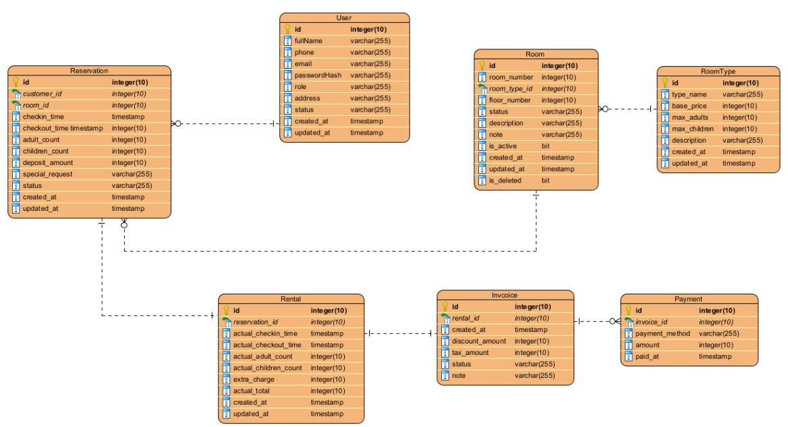

- Yêu cầu chức năng:
STT	Chức năng của phần mềm	Tên tác nhân	Mô tả chi tiết 	Note
F1	Quản lý phòng	Staff	Thêm phòng mới	Thông tin phòng có thể gồm (Mã phòng, tên phòng, số phòng, loại phòng, tầng, số người, giá thuê theo ngày/giờ, trạng thái phòng, mô tả, ghi chú)
			Sửa thông tin phòng	
			Xóa phòng	
			Xem danh sách phòng	
			Xem chi tiết danh sách phòng	
F2	Quản lý loại phòng	Staff	CRUD loại phòng	Ví dụ một số loại phòng: Standard, Deluxe, VIP, family, ...
			Khai báo giá cơ bản	
			Số người tối đa	
			Tiện nghi	
F3	Tra cứu phòng trống	Staff, Customer, Admin	Xem danh sách phòng trống hiện tại	
			Lọc phòng theo ngày nhận - trả	
			Xem lịch trống của từng phòng	
			Lọc phòng theo giá, sức chứa, loại phòng, ...	
F4	Đặt phòng	Staff, Customer	Tạo phiếu đặt phòng	Thông tin phiểu thuê (invoice?): mã, khách hàng, phòng, ngày giờ nhận phòng, ngày giờ trả phòng dự kiến, ngày giờ trả thực tế, đơn giá, tiền cọc, phụ thu, ...
			Checkin	
			Checkout	
			Hủy đặt phòng	
			Đổi phòng (nếu cần)	
			Cập nhật số lượng khách ở	
F5	Quản lý khách hàng	Admin	CRUD khách hàng	Thông tin khách hàng: mã, họ tên, sđt, email, CCCD, địa chỉ, quốc tịch
			Tra cứu khách hàng	
			Xem lịch sử thuê của khác	
F6	Quản lý nhân viên	Admin	CRUD nhân viên	Thông tin nhân viên: mã, họ tên, sđt, email, chức vụ, tài khoản, trạng thái
			Phân quyền	
			Xem danh sách nhân viên	
			Gán vai trò	
F7	Quản lý hóa đơn thuê	Admin	Tạo hóa đơn 	
			Xem danh sách hóa đơn	
			Xem chi tiết hóa đơn	
			In hóa đơn	
F8	Theo dõi trạng thái phòng	All	Xem trạng thái các phòng	Có thể tạo cronjob để nhắc nhớ lịch checkin hoặc checkout
F9	Thông kê báo cáo	Admin	Thống kê số phòng đang thuê	Biểu đồ, Excel, ...
			Thông kê số phòng trống	
			Thông kê doanh thu theo thời gian	
			Thông kê doanh thu theo phòng	
			Thống kê điện nước	
			Thống kê theo loại phòng	